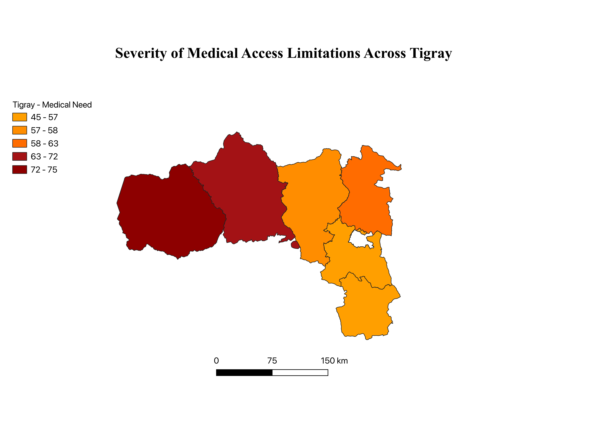
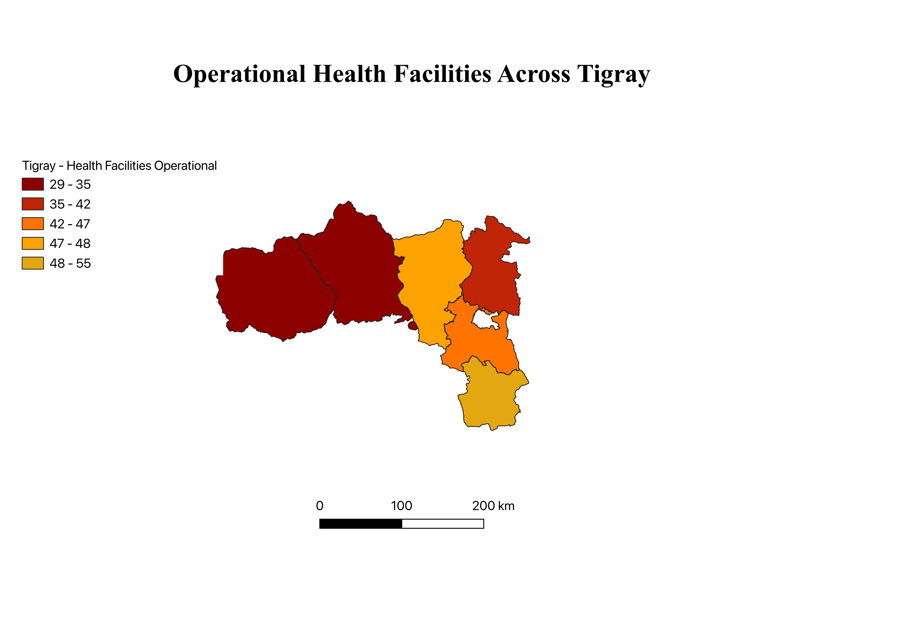
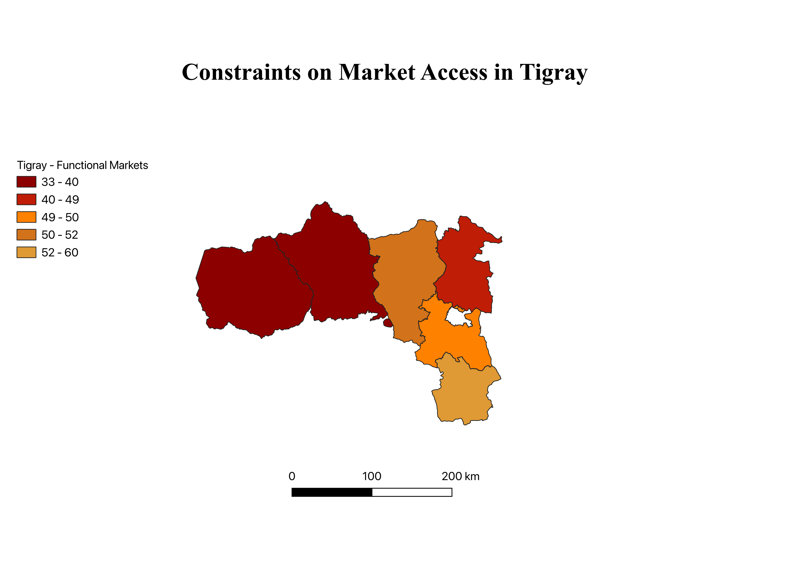

# Tigray-Humanitarian-Crisis
Tigray Crisis Analysis

## Project Overview
This project presents a spatial analysis of humanitarian conditions in the Tigray region of Ethiopia, combining geospatial visualization with data preprocessing and exploratory analysis. The goal is to examine spatial patterns in food insecurity, internal displacement, medical access constraints, and health facility functionality during the crisis period, while acknowledging the limitations of humanitarian data availability.

Rather than attempting to map all crisis dimensions, this project uses a focused set of indicators and complements the maps with contextual analysis of broader systemic impacts such as agriculture disruption and market access constraints.

---

## Data & Methods

### Data Sources
- Humanitarian datasets sourced from the Humanitarian Data Exchange (HDX)
- Administrative boundaries at the zone level
- Reported indicators related to food insecurity, displacement, and health facility operations

### Python (Data Preparation & Validation)
Python was used for data cleaning, preprocessing, and exploratory analysis, including:
- Standardizing administrative names across datasets
- Filtering and structuring indicators for spatial compatibility
- Creating derived metrics (e.g., displacement relative to population)
- Validating distributions and severity rankings prior to mapping

### QGIS (Spatial Analysis & Visualization)
- Zone-level administrative boundaries were used for spatial joins
- Processed datasets were joined using standardized identifiers
- Graduated symbology was applied to visualize relative intensity rather than absolute precision
- Each thematic layer was exported as static PNG outputs with consistent map extent and styling
---

## Assessment Analysis

This project includes a full written assessment analyzing humanitarian conditions in Tigray, combining spatial findings with contextual discussion of food insecurity, market access, medical constraints, internal displacement, and agricultural disruption.

- - 📄 **Supplementary (Markdown – Git-readable):**  
  [Tigray Assessment Analysis](analysis/Tigray_Assessment_Analysis.md)

- 📑 **PDF version (formatted submission):**  
  [Tigray Analytical Assessment (PDF)](analysis/Tigray_Analytical_Assesment.pdf)
---

## Map Visualizations

### Food Insecurity Severity Across Tigray Zones

*This map illustrates relative food insecurity severity across administrative zones in Tigray, highlighting spatial variation in food access challenges during the crisis period.*

---

### Medical Access Constraints Across Tigray Zones

*This map shows relative constraints on access to medical services across Tigray zones, reflecting disparities in healthcare availability and accessibility.*

---

### Internal Displacement Across Tigray Zones

*This map displays the distribution of internally displaced persons (IDPs) aggregated by administrative zone, emphasizing relative displacement patterns.*

---

### Operational Health Facilities Across Tigray Zones

*This map illustrates the relative availability of reported operational health facilities across Tigray zones, indicating geographic variation in health system functionality.*

---

### Functional Market Access Across Tigray Zones

*This map shows reported levels of market functionality across Tigray zones, indicating geographic variation in access to markets rather than real-time economic activity.*
---

## Why This Analysis Matters
This project demonstrates how spatial analysis can be used to explore humanitarian conditions in data-constrained and conflict-affected settings. By combining Python-based preprocessing with GIS visualization, the analysis highlights spatial disparities while avoiding over-interpretation of incomplete or uncertain data.

---

## Limitations & Ethical Considerations
- Pre-2020 subnational humanitarian data availability is limited
- Reporting constraints during conflict affect data completeness
- Maps represent relative patterns, not exact measurements
- Certain crisis dimensions are discussed contextually rather than spatially to avoid misrepresentation

---

## Tools Used
- Python (pandas, matplotlib)
- QGIS
- GitHub for version control and public documentation

---

## Author
Mahdere  F
Business Administration ~ Information Systems  
Seattle Pacific University
