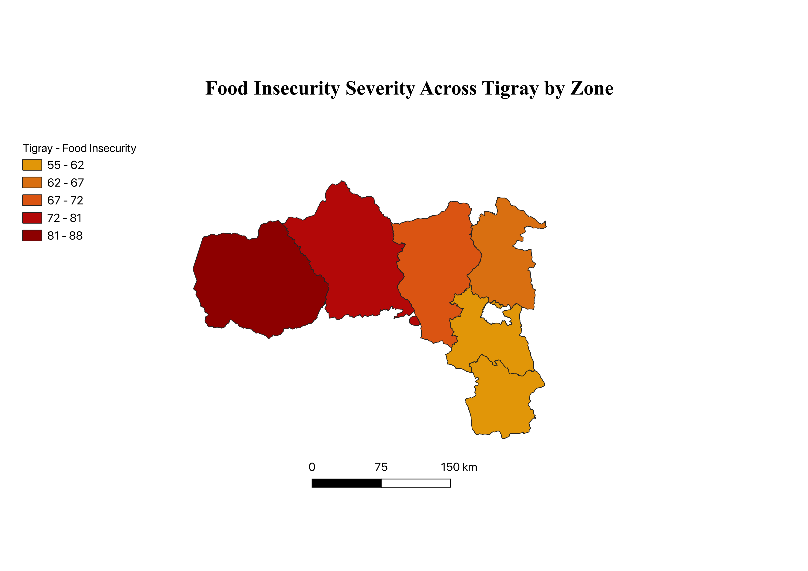
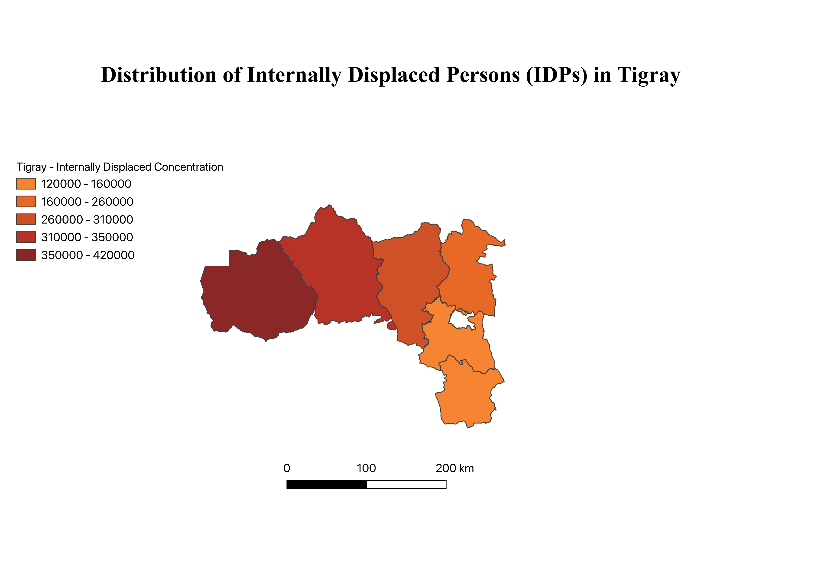

# Tigray Humanitarian Crisis
[](https://creativecommons.org/licenses/by-nc-nd/4.0/)

**In-depth Analysis into the Genocidal Crisis in Tigray.**

## Project Overview

This repository presents a geographical analysis of humanitarian conditions in the Tigray region, combining geospatial visualization with data preparation and exploratory analysis. The goal is to examine geographical patterns in food insecurity, internal displacement, medical access constraints, and health facility functionality during the crisis period, while also acknowledging the limitations of humanitarian data availability.

This goal is addressed through the use of multiple geographical layers, which are visually and analytically compared to identify overlapping and divergent patterns across the study area.

Rather than attempting to map all crisis points, this project uses a focused set of data and complements the maps with contextual analysis of broader systemic impacts such as agriculture disruption and market access constraints.

---

## Project Resources

### Tigray Conflict Timeline
A detailed chronological timeline documenting key political, military, and humanitarian events during the Tigray War (2020–present). The timeline compiles investigations from international organizations, humanitarian reports, investigative journalism, and advocacy documentation to provide context on major incidents including civilian massacres, infrastructure destruction, humanitarian access restrictions, displacement, and military developments throughout the conflict.
- [Tigray Conflict Timeline](./timeline/Tigray%20Conflict%20Timeline.md)

### Tigray Humanitarian Assessment
Included below is a full written assessment analyzing humanitarian conditions in Tigray, connecting geographical data with contextual assessment of food insecurity, market access & stability, medical constraints, internal displacement, and agricultural disruption.

- **Markdown version (GitHub-readable):**
  [Tigray Assessment Analysis](./reports/Tigray_Humanitarian_Assessment_and_Sources/Tigray_Assessment_Analysis.md)

- **PDF version (formatted submission):**
  [Tigray Humanitarian Assessment (PDF)](./reports/Tigray_Humanitarian_Assessment_and_Sources/Analysis_of_Humanitarian_Crisis.pdf)

### Reference Library
**A curated collection of reports, investigations, humanitarian updates, government publications, academic research, and international news resources documenting the humanitarian crisis in the Tigray Region.**
- [Reference Library of the Tigray Crisis](./references/Reference-Library.md)


### Repository Structure

```text
README.md
references/
├── Reference-Library.md
timeline/
└── Tigray Conflict Timeline.md
reports/
└── Tigray_Humanitarian_Assessment_and_Sources/
    ├── Analysis_of_Humanitarian_Crisis.pdf
    └── Tigray_Assessment_Analysis.md
maps/
└── exported_maps/
    ├── Tigray_Food_Insecurity.png
    ├── Tigray_Functional_Markets.png
    ├── Tigray_Health_Facilities_Operational.png
    ├── Tigray_IDP_Distribution.png
    └── Tigray_Medical_Needs.png
```

## Hitsats IDP Center Crisis

Information is sourced through reported humanitarian conditions in Tigray, including the current dire situation at the Hitsats internally displaced persons (IDP) & refugee center. From May 2025 at least 333 displaced people have died from lack of medical care & starvation. Local media reported that more than 1,700 IDPs at Hitsats are in critical condition amid severe hunger, malnutrition and a lack of medical care, with many elderly people, women, and children collapsing due to extreme food shortages and limited access to health services. Officials further stated that at least dozens of deaths have been linked to these conditions as humanitarian assistance remains insufficient and access continues to be constrained.

These circumstances illustrate the severe humanitarian impacts of conflict-related access constraints and infrastructure breakdown which tell us these cases aren't isolated circumstances. They provide an important background for interpreting the geographical patterns of displacement, food insecurity, and medical need presented in this analysis.

Addis Standard (2023). *Over 1,700 IDPs at Hitsats Center in Tigray in Critical Condition Amid Severe Hunger, Lack of Medical Care.*
https://addisstandard.com/over-1700-idps-at-hitsats-center-in-tigray-in-critical-condition-amid-severe-hunger-lack-of-medical-care/


---

## Data & Methods

### Data Sources
- Humanitarian datasets sourced from the Humanitarian Data Exchange (HDX)
- Administrative boundaries at zone level
- Reported data metrics related to food insecurity, displacement, and health facility operations

### Python
Python was used for data cleaning, preprocessing, and exploratory analysis, which included:
- Standardizing administrative names across datasets
- Filtering and structuring indicators for geographic compatibility
- Creating derived metrics (displacement relative to population)
- Validating distributions and severity rankings prior to mapping

### QGIS
- Zone-level administrative boundaries were used for geographic joins
- Processed datasets were joined using standardized identifiers
- Graduated symbology was used to represent relative intensity across areas rather than a single absolute value
- Each thematic layer was exported as static PNG outputs with consistent map extent and styling

---

## Map Visualizations

### Food Insecurity Severity Across Tigray Zones


*This map highlights the relative food insecurity severity across administrative zones in Tigray, highlighting geographical variation in food access challenges during the crisis period.*

---

### Medical Access Constraints Across Tigray Zones


*This map visualizes relative differences in constraints on access to medical services across Tigray zones, reflecting disparities in healthcare availability and accessibility.*

---

### Internal Displacement Across Tigray Zones


*This map displays the distribution of internally displaced persons (IDPs) aggregated by administrative zone, emphasizing relative displacement patterns.*

---

### Operational Health Facilities Across Tigray Zones


*This map illustrates differences in the reported operational health facilities across Tigray zones, indicating geographical variation in health system functionality.*

---

### Functional Market Access Across Tigray Zones


*This map shows reported levels of market functionality across Tigray zones, indicating geographic variation in access to markets rather than real-time economic activity.*

---

## Why This Analysis Matters
This project demonstrates how geographical analysis can be utilized to explore humanitarian conditions in data-constrained and conflict-affected settings. By combining Python-based data preparation with GIS visualization, this analysis highlights geographical disparities while being careful to avoid over-interpretation of incomplete or uncertain data in order to bring proper awareness of the humanitarian situation in the region.

---

## Limitations & Ethics
- Pre-2020 subnational humanitarian data availability is limited
- Reporting constraints during conflict affect completeness of data
- Maps represent relative patterns, not exact measurements
- Certain crisis dimensions are discussed contextually rather than geographically for clarity and to avoid misrepresentation

---

## Tools Used
- Python (pandas, matplotlib)
- QGIS
- GitHub for version control and public documentation

---

## Analyst
**Mahdere Fikre**

**Seattle Pacific University**

Bachelor of Arts in Business Administration 
Concentration in Information Systems
Minor in Data Analytics
